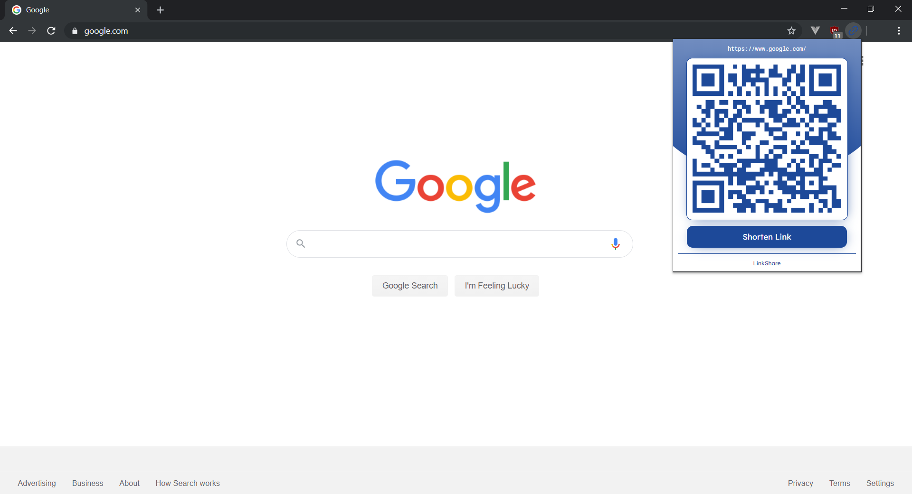
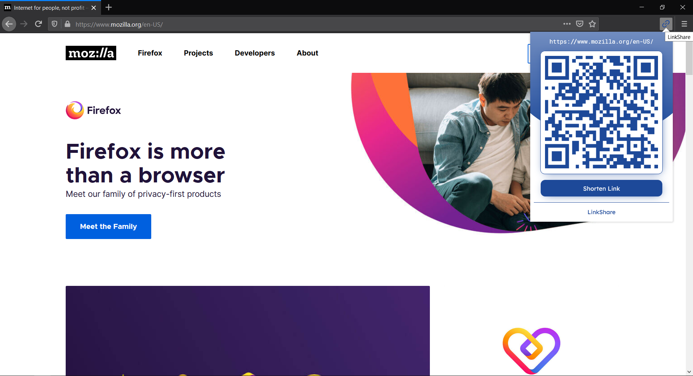

# LinkShare
> Share links instantly

LinkShare is a browser extension that lets you share links instantly. By clicking the icon, the extension generates a QRCode for the current tab your in. This is eliminates the hassle in sharing links. So next time, when your in a middle of a presentation and would like to share a link, just tap LinkShare!

| Supported Browsers | Download Link |
|---|---|
| Chrome | Not Yet Available |
| Firefox | https://addons.mozilla.org/en-US/firefox/addon/link-share/ |

## Dependencies
LinkShare is built with [qrcode.js](https://davidshimjs.github.io/qrcodejs/) and [is.gd](https://is.gd/apishorteningreference.php) url shortener

## License
MIT
